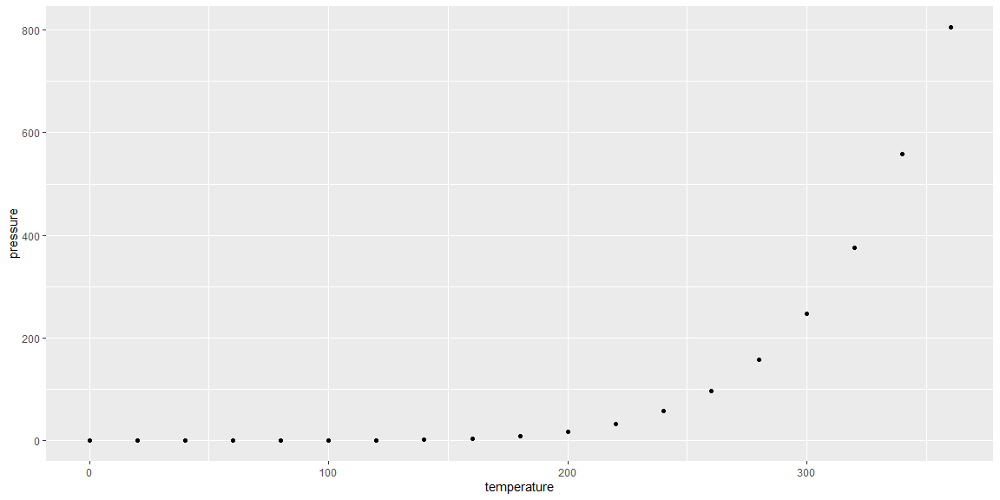

## R Markdown

This is an R Markdown document. Markdown is a simple formatting syntax for authoring HTML, PDF, and MS Word documents. For more details on using R Markdown see <http://rmarkdown.rstudio.com>.

When you click the **Knit** button a document will be generated that includes both content as well as the output of any embedded R code chunks within the document. You can embed an R code chunk like this:


```r
library(tidyverse)
```


```r
summary(cars)
```

```
##      speed           dist       
##  Min.   : 4.0   Min.   :  2.00  
##  1st Qu.:12.0   1st Qu.: 26.00  
##  Median :15.0   Median : 36.00  
##  Mean   :15.4   Mean   : 42.98  
##  3rd Qu.:19.0   3rd Qu.: 56.00  
##  Max.   :25.0   Max.   :120.00
```

#### Including Plots

---  <!-- THIS COLORED PART IS COMMENTED OUT, but the three dashes in front of the comment make a little dividing line in you knited document -->

You can also embed plots, for example:


```r
# Now when you want to make a inside of and R chunk you would need to put the # sign in front so it's a little different depending on if you are inside or outside of an R chunk.
pressure %>% 
  ggplot(aes(x = temperature, y = pressure)) +
  geom_point()
```

<!-- -->

Note that the `message=F, warning=F` parameter was added to the code chunk to prevent printing of warnings that or other messages that might be tied to the graph. Sometimes R removes variables like NA's automatically and it would warn you when it does adding `message=F, warning=F` would remove that warning. 

Also if you noticed above there are 4 **#** in front of Including Plots which makes the Section header smaller then the one above it. The more **#** you put in front the smaller the section header gets.


## Scripts 

Scripts are another type of document that you can use in Rstudio, it's basically a text file where you can write commands that you would write either in an R chuck as shown above or in the console. I like to think of as scratch paper for my coding. 

Scripts do not knit into documents like RMD's but they can be very helpful to source or to create you visuals or do your wrangling before you put your information into an RMD. We will work with both but ultimately its up to personal preference. 

## Console 


## Libraries and Packages 


## Working Directory, Paths, and Reading in Data


## Extras for Fun!! 


