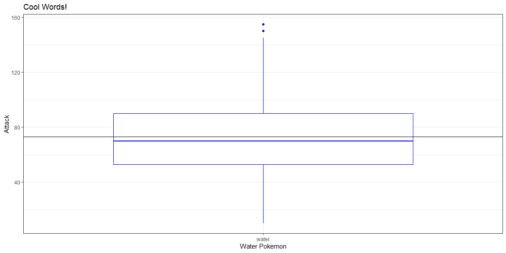

```r
## loading libraries
library(tidyverse)
```


```r
## lets start by reading in the data 
## Don't forget to set the session!!
## Lets read in the cereal and the pokemon datasets
cereal <- read_csv("../../data/cereal.csv")
pokemon <- read_csv("../../data/pokemon.csv")
```


## Summary Stats

Summary Stats Vocab list:

 * Mean - the center of mass of quantitative data, it is also known as the average - `mean(object)`
 * Median -  the middle of the data - `median(object)`
 * Mode - most commonly occurring digit ever - `table(object)`
 * Minimum - the smallest occurring data point - `min(object)`
 * Maximum - the largest occurring data point - `max(object)`
 * Quartiles - a measure of center and spread - `quantile(object, percentile)`
 * Standard Deviation - a measure of how spread out the data is - `sd(object)`
 
 
## Questions

##### Pokemon
 
What is a the average `attack` of a water `type1` pokemon? What water `type1` pokemon is the fastest? How do these compare with the rest of the water type pokemon looking at `attack` and `speed` respectively?
 
To answer some of these questions we might need to filter out some of our data it would be good to look at the `filter()` function. (Other functions that might be fun to play with are `group_by()`, `summarise()`, `select()`, `c()`, and `mutate()`)
 

```r
waterPokemon <- pokemon %>% 
  filter(type1 %in% c("water"))

mean(waterPokemon$attack)
```

```
## [1] 73.30702
```

```r
table(waterPokemon$type1)
```

```
## 
## water 
##   114
```


```r
  waterPokemon %>% 
    ggplot(aes(x = type1, y = attack),) +
    geom_boxplot( color = "blue") + 
  geom_hline(yintercept = 73) + 
    labs(title = "Cool Words!", x = "Water Pokemon", y = "Attack") +
    theme_bw()
```

<!-- -->

 
 
##### Cereal

How do the distributions of `fiber` compare across the different manufactures? 


What are the top 10 cereals with the most `protien`?


What are the 5 cereals with the lowest `rating`? Why do the have those ratings?


## Extra!!

What's a question you have? Can you answer that with data? Find the data set you need!


 
 
 


