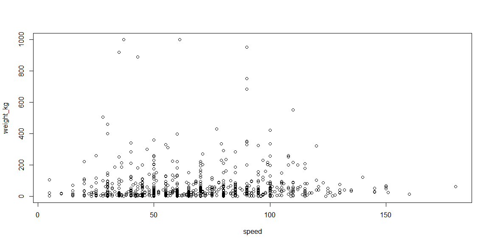
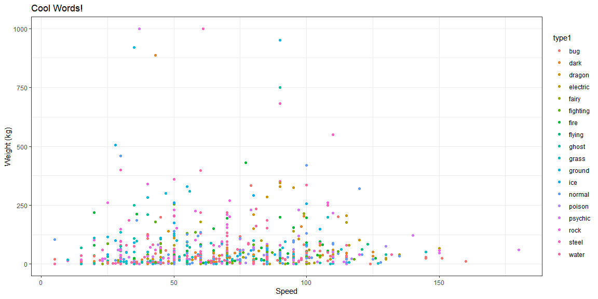
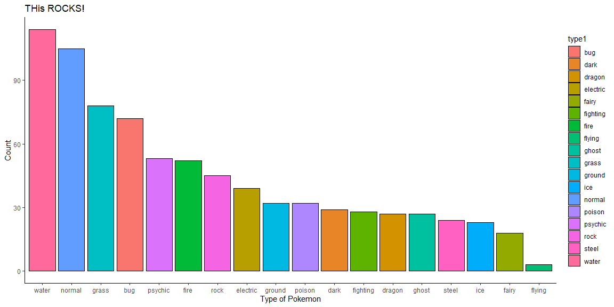
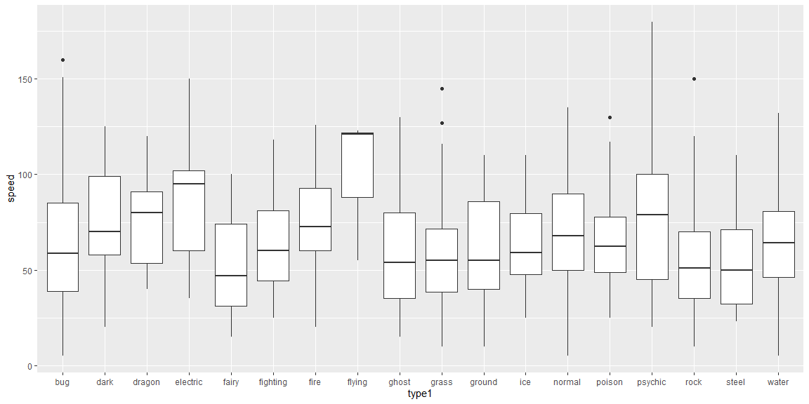

```r
## loading libraries
library(tidyverse)
```

## Ggplot 

The library `ggplot` can be accessed alone or you can accesses it through the `tidyverse` package. The `ggplot` package is a very nice package for making clean and aesthetically pleasing visualizations. You are able to create graphs with base R functions, let's compare the graphing the two different types. 


```r
## lets start by reading in the data 
## Don't forget to set the session!!
## Lets read in the cereal and the pokemon datasets
cereal <- read_csv("../../data/cereal.csv")
pokemon <- read_csv("../../data/pokemon.csv")
```


#### Scatterplots 
 
Scatterplots are good for 2 quantitative variables, it's you basic (x,y) graph. 


```r
## We don't want to keep reading the dataset in to our environment so we're going to graph in this chunk.

#colnames(pokemon)

## First the base r plot 
plot(weight_kg ~ speed, data=pokemon)
```

<!-- -->

```r
## Now the ggplot
 pokemon %>% 
   ggplot(aes(x = speed, y = weight_kg, color = type1)) +
   geom_point() +
   labs(title = "Cool Words!", x = "Speed", y = "Weight (kg)") +
   theme_bw()
```

<!-- -->


#### Bar Charts 

Bar charts are counting graphs so the are best for Qualitative variables. You will want your variables to be factors.


```r
## Base r

#barplot(table(data$Colname), col = "blue", xlab = "Name")

## ggplot 
 pokemon %>%
  group_by(type1) %>% 
  summarise(Count = n()) %>% 
   ggplot(aes(x = reorder(type1, -Count), y = Count, fill = type1)) +
   geom_bar(stat = "identity", position = "dodge", color = "black") +
   labs(x = "Type of Pokemon", title = "THis ROCKS!") +
  theme_classic()
```

```
## `summarise()` ungrouping output (override with `.groups` argument)
```

<!-- -->

```r
## For if you want more than one variale 
# data %>%
#   ggplot(aes(x = Colname, fill = Colname)) +
#   geom_bar(position = "dodge", color = "black") +
#   labs(x = "Name")
```

If you want to try out other colors go [here](http://www.stat.columbia.edu/~tzheng/files/Rcolor.pdf)

#### Boxplots

Boxplots are a great way to depict the basic five-number summary graphically. So its good for comparing distributions between different groups.


```r
## Base r
#boxplot(object ~ group, data=NameOfYourData)

table(pokemon$type1)
```

```
## 
##      bug     dark   dragon electric    fairy fighting     fire   flying 
##       72       29       27       39       18       28       52        3 
##    ghost    grass   ground      ice   normal   poison  psychic     rock 
##       27       78       32       23      105       32       53       45 
##    steel    water 
##       24      114
```

```r
## Now the ggplot
 pokemon %>% 
  #filter(type1 == "water") %>% 
   ggplot(aes(x = type1, y = speed)) +
   geom_boxplot()
```

<!-- -->


## Extra's 

Create your own graph using the ggplot [cheetsheet](https://rstudio.com/wp-content/uploads/2015/03/ggplot2-cheatsheet.pdf)
Try somthing fun! 


```r
## HINT to make more R chunks you can hit ctrl+alt+i
```


